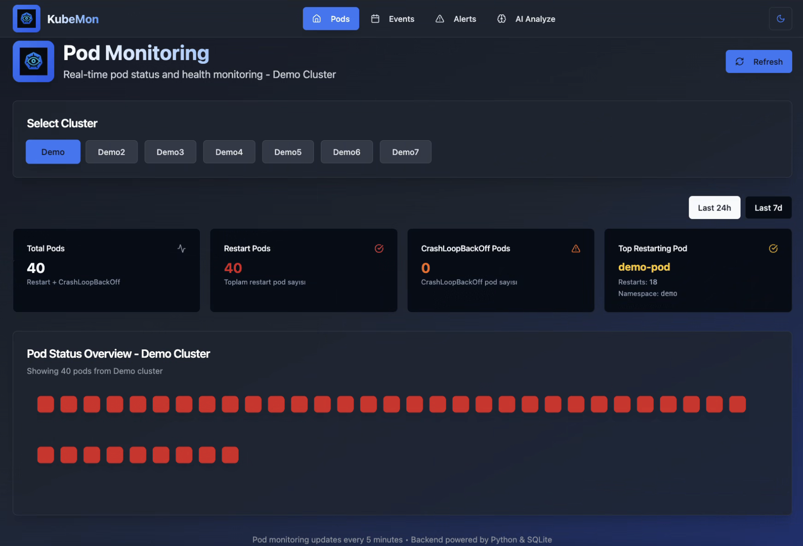
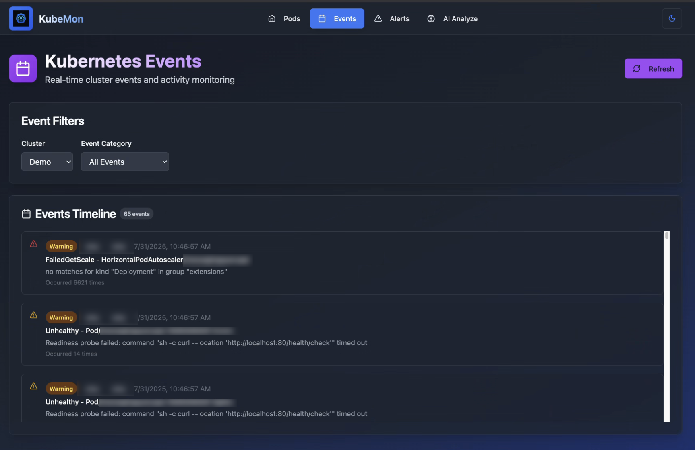
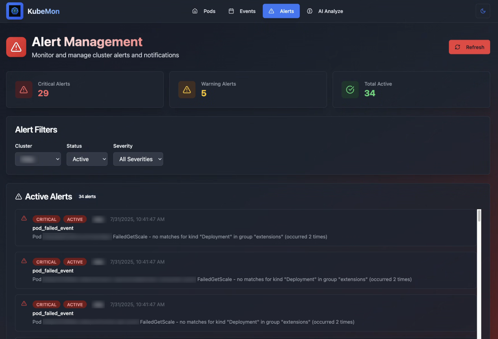

# 🚀 KubeMon

**License:** ---

## ✨ Özelliklerform:** Docker · Kubernetes

KubeMon, bir veya birden fazla Kubernetes cluster’ını merkezi ve gerçek zamanlı olarak izleyebileceğiniz, pod ve cluster sağlığını görselleştiren açık kaynak monitoring ve dashboard uygulamasıdır.

### 📊 Dashboard
KubeMon'un ana dashboard ekranı - cluster'larınızın genel durumunu tek bakışta görün:



### 📋 Events
Kubernetes cluster'ınızdaki tüm event'leri gerçek zamanlı olarak takip edin:



### 🚨 Alerts
Kritik uyarıları ve alarm durumlarını anında görüntüleyin:



### 🤖 AI Analyze
OpenAI destekli akıllı analiz ile event'lerinizi derinlemesine inceleyin:


---

## ✨ Özellikleron

**License:** MIT  
**Platform:** Docker · Kubernetes

KubeMon, bir veya birden fazla Kubernetes cluster’ını merkezi ve gerçek zamanlı olarak izleyebileceğiniz, pod ve cluster sağlığını görselleştiren açık kaynak monitoring ve dashboard uygulamasıdır.

---

## ✨ Özellikler

- 🔄 **Multi-Cluster Monitoring:** Birden fazla Kubernetes cluster’ını tek arayüzden takip edin
- 🎨 **Modern Arayüz:** Kullanıcı dostu, responsive ve canlı veri güncellemesi
- 🐳 **Docker Desteği:** Tek komutla kolay kurulum ve başlatma
- 🤖 **AI Destekli Analiz:** OpenAI ile event ve alert verilerini analiz edin, kök neden ve öneriler alın
- 🔒 **Güvenli:** Gizli anahtarlar ve kubeconfig dosyaları repoda paylaşılmaz
- ⚡ **Hızlı:** Optimize backend API ile yüksek performans

---

## 🛠️ Teknolojiler

**Frontend:**  
- React.js (TypeScript)
- Modern CSS

**Backend:**  
- Python API
- Kubernetes API entegrasyonu

**Altyapı:**  
- Docker & Kubernetes
- Azure DevOps pipeline desteği

---

## 📋 Gereksinimler

- Docker ve Docker Compose
- Geçerli Kubernetes cluster erişimi
- Kendi .env ve secret dosyalarınız

---

## 🚀 Hızlı Başlangıç

1. **Projeyi İndirin**
   ```bash
   git clone https://github.com/[username]/KubeMon.git
   cd KubeMon
   ```

2. **Ortam Dosyalarını Ekleyin**
   - `.env` dosyasını oluşturun ve anahtarlarınızı girin:
     ```
     OPENAI_API_KEY=your-openai-key
     VITE_API_URL=/api
     ```
   - Kubeconfig ve secret dosyalarınızı repoya eklemeyin!

3. **Uygulamayı Başlatın**
   ```bash
   docker build -t kubemon .
   docker run -p 8080:80 -v $(pwd)/data:/app/data kubemon
   ```
   veya Kubernetes ile:
   ```bash
   kubectl apply -f k8s-deployment.yaml
   ```

4. **Uygulamayı Açın**
   - Web arayüzü: [http://localhost:8080](http://localhost:8080)

---

## 🔧 Cluster Konfigürasyonu

KubeMon, her cluster için belirli namespace'leri filtreleyerek güvenli ve organize monitoring sağlar. Kendi ortamınıza uygun şekilde yapılandırabilirsiniz:

### **Namespace Filtreleme**

`backend/cluster_config.py` dosyasında cluster'larınızı ve izlemek istediğiniz namespace'leri tanımlayın:

```python
CLUSTER_NAMESPACE_CONFIG = {
    "demo1": {
        "allowed_namespaces": ["demo1"],
        "exclude_namespaces": []
    },
    "production": {
        "allowed_namespaces": ["production"],
        "exclude_namespaces": []
    },
    "staging": {
        "allowed_namespaces": ["staging"],
        "exclude_namespaces": []
    }
}
```

### **Özelleştirme**

- **`allowed_namespaces`**: Sadece bu namespace'lerdeki pod'ları ve event'leri göster
- **`exclude_namespaces`**: Bu namespace'leri gizle (gelecek özellik)
- **`default`**: Tanımlanmamış cluster'lar için varsayılan davranış

### **Güvenlik Avantajları**

- 🔒 **Namespace İzolasyonu**: Her cluster sadece kendi namespace'lerini görür
- 👥 **Multi-Tenant Desteği**: Farklı ekipler farklı cluster'larda çalışabilir
- 🛡️ **Veri Güvenliği**: Hassas namespace'ler gizlenebilir

---

## ⚠️ Güvenlik Notu

- Gizli anahtarlar, kubeconfig ve secret dosyalarını asla repoya commit etmeyin!
- Örnek .env ve secret dosyalarını kendi ortamınızda oluşturun.

---

## 📄 Lisans

Bu proje MIT lisansı ile sunulmaktadır.

---
